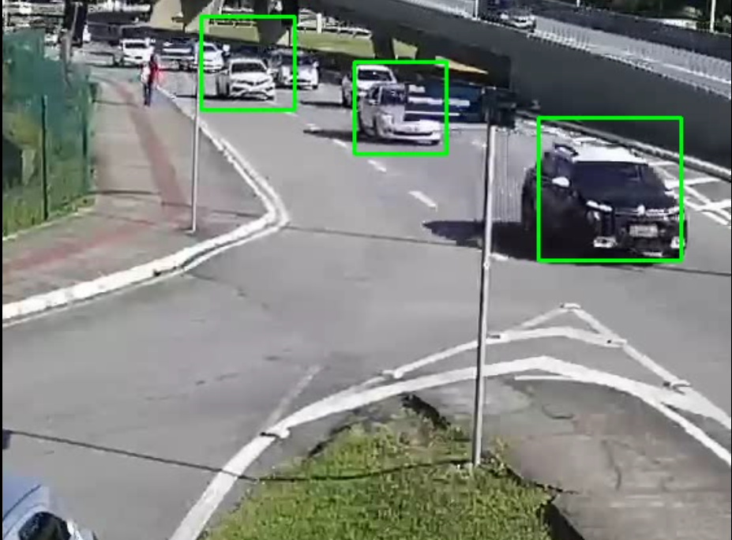

# Car detection applicarion using Haar Cascade Classifier
An application that uses concepts of Computer vision to detect cars in video footage using Haar cascade classifier. 

## Getting Started

### Requirements 

I used conda for package environment management, So if you want to run the application you can run create one environment with

```
conda create --name cardetection python=3.7
```
with this environment activated you can install opencv library with the following comand.

```
conda install opencv=3.4.2
```

Is important to choose the right version of opencv, because if you choose another version it can ask for downgrading your python version and we don't want that. :)

# Results

After training and tweaking the parameters to better train my model these were the results:

The model was able to detect many cars at once:


And also to detect it in motion:  


# How to use this code to detect other things

If you just want to re-execute my application on your PC to see the results there is not much to say other than clone the repo install conda environment and packages and execute it. However if you want to know the steps I followed to be able to apply Haar Cascade Classifiers, to create your own code for detecting other stuff follow these directions:

1. **Separate positive and negative files to their respective folders**  
Choose the photos/video in which you will detect objects. Separate between positive and negative folders, move to positive pictures where the object you want to detect is present, move to negative pictures without the object. You can read in the [opencv's documentation](https://docs.opencv.org/4.2.0/dc/d88/tutorial_traincascade.html) how the files should be named and what will be needed from opencv further.

You can use my function in trainerutils.py to generate the negative.txt file that list pictures following opencv rules:
```
python
from trainerutils import generate_negative_description_file
```

2. **Download opencv_annotation executable**  
For the images in the positive folder to work you will need to use [opencv_annotation](https://sourceforge.net/projects/opencvlibrary/files/opencv-win/) and do the tedius but needed process of marking the object you want within pictures in the positive folder.

Annotate your positive pictures:
```
opencv_annotation.exe --annotations=positive.txt --images=positive/
```

3. **Create a vector file create samples**  
Create a vector file using opencv_createsamples executable, that comes together opencv_annotation. Select width and height of boxes to be sampled by opencv within the annotations you did and also more or less the number of boxes you draw  

Create your sampled vector file:
```
opencv_createsamples.exe -info positive.txt -w 24 -h 24 -num 1000 -vec positive.vec
```

**Obs:** Becareful if the last picture has fake box(0) the program will run indefinetely .

4. **Now lets train the Cascade Classifier**  
Run the opencv_traincascade executable to train your haar cascade classifier locally. There are many parameters you can play with when training your model to reach a better results, you can check them [here](https://docs.opencv.org/4.2.0/dc/d88/tutorial_traincascade.html).

I used the following parameters:
```
opencv_traincascade.exe -data cascade/ -vec positive.vec -bg negative.txt -w 24 -h 24 -numPos 800 -numNeg 400 -numStages 12
```

5. **Tips to improve your model:**
There parameters you can tweak to make your model better and examples are:
+ -numPos 800 -numNeg 400:  
You can always play with those numbers and ofcourse if you can increase the amount of data or the quality of the pictures your model will improve. 
+ -numStages 12
If your model is not missing many objects in the scene you can increase the number of stages, if there are too many false positives you can reduce it.
+ -maxFalseAlarmRate 0.3
You can limit the training to finish earlier to avoid overfitting.
+ -minHitRate 0.999
You can also allow the classifier to only go to the next stage if a hit rate threshold is reached.  

I executed my application with the following parameters:
```
opencv_traincascade.exe -data cascade/ -vec positive.vec -bg negative.txt -w 24 -h 24 -numPos 800 -numNeg 400 -numStages 12 -maxFalseAlarmRate 0.3 -minHitRate 0.999
```